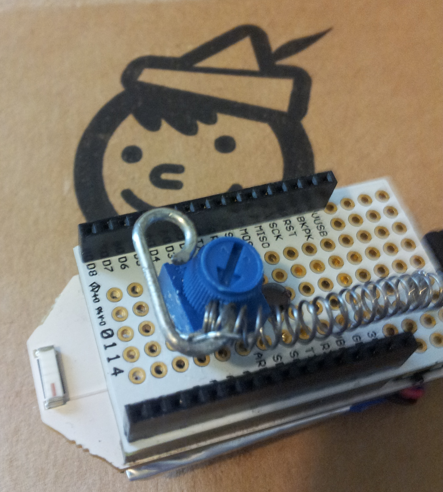

pinoccio-pull-force-sensor
==========================

ScoutScript example function to manage a diy pulling force sensor.

i needed a pulling force sensor where most of the sensors i found were for pressure.

## in action!

serial monitor output.
```
going up  18
20 0 2
40 20 0
72 40 20
109 72 40
168 109 72
216 168 109
238 216 168
238 238 216
going down -57
181 238 238
75 181 238
0 75 181
2 0 75
```

## build



### parts

- pinoccio protoboard
- 10k trimpot
- spring from clicky pen
- stiff wire (took mine from a clothes pin)
- glue
- 4 or 5 staples for an office stapler. used to secure the spring. they are stronger than they look!

### tools

- soldering iron.
- needle node pliers 
- drill (optional) i used this to drill a whole for the led and drill a hole in the lid of the trim pot

### install

copy the contents index.bl into the serial monitor or send it as a command through the api to a scout!

with the pinccio cli.

```sh
cd pinoccio-pull-force-sensor
pinoccio rest get v1/1/1/command/"`cat index.bl`"

```

and run the task in a startup function

the startup.bl installs the force sensor to ```startup.f``` one of the general purpose a-z startup functions.

```sh
pinoccio rest get v1/1/1/command/"`cat startup.bl`"
```

or add it to your existing main startup function.

```
function startup {
  run forcesensor;
}
```


